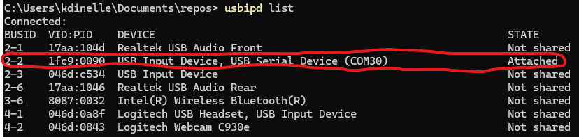
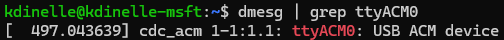
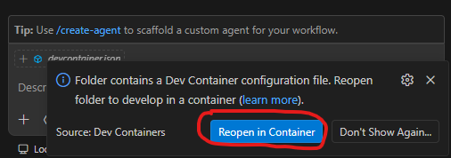
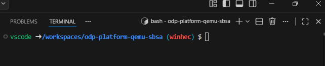
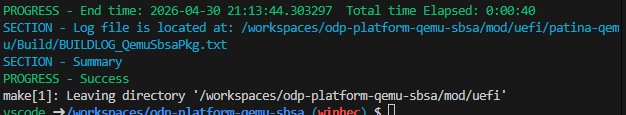
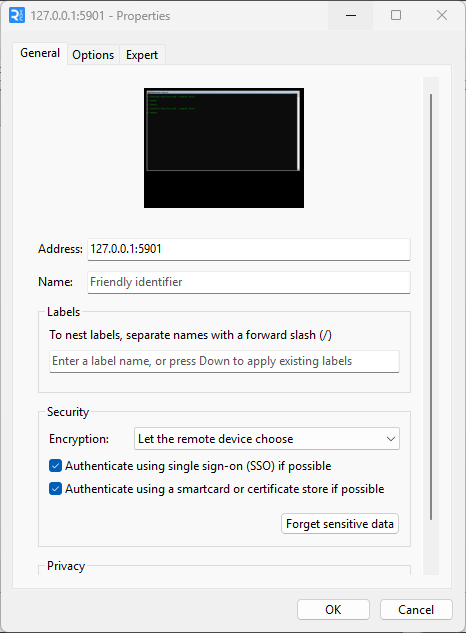
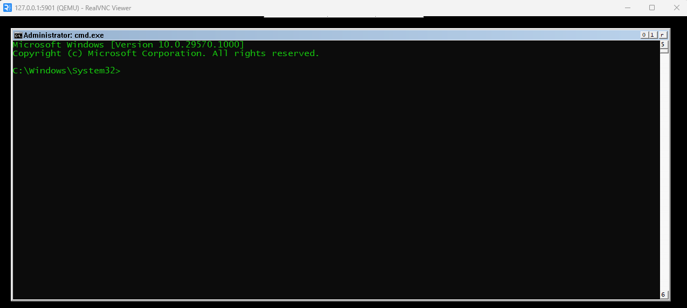
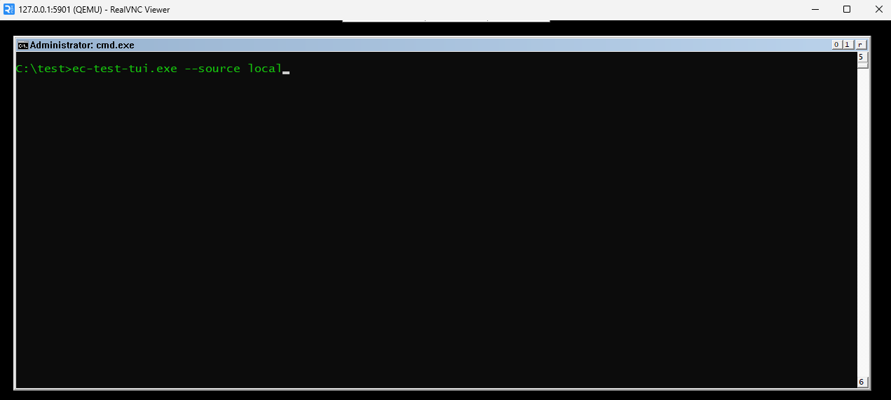
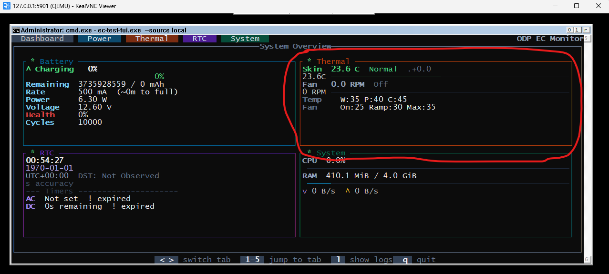

# WinHEC Demo Setup
This document will guide you through getting everything set up to run the ODP tui app inside a WinVOS image
running on top of QEMU SBSA which communicates with an external NXP RT685-EVK board over a serial connection.

**NOTE**: It is highly recommended that you use a x64 host machine for running this demo.
The demo requires USB passthrough to WSL which can be very buggy on ARM64 machines and not guaranteed to work correctly.

## EC Setup
Please see [odp-embedded-controller/winhec-demo](https://github.com/kurtjd/odp-embedded-controller/blob/winhec-demo/platform/winhec-demo/README.md) for instructions on how to get the IMXRT board set up to act as the EC. 

After you have completed those steps (so make sure you've flashed the board and detached probe-rs),
ensure the board is connected via USB to your host machine (the machine that will be running the qemu-sbsa instance) and powered on. 

From a PowerShell prompt in Windows, run `usbipd list` to see information about the USB connection.
On my machine you will see `2-2` corresponds to the IMXRT board USB connection and I already have it
attached to WSL.

Since you will likely not already have it attached, follow [Connect USB devices | WSL](https://learn.microsoft.com/en-us/windows/wsl/connect-usb) to share and attach the USB connection to WSL, which is necessary for serial over USB comms.

Now open WSL and confirm you see the board is mapped to serial port `/dev/ttyACM0` using the `dmesg | grep ttyACM0` command:

If so, the EC is ready to communicate with the TUI app inside QEMU over serial!

## WinVOS Setup
Download the WinVOS image that contains everything needed (including the tui app) from desmo share:  
`\\desmo\WDGShare\Shared\kdinelle\winhec\qemu-sbsa\ValidationOS.vhdx`

Then place it in the `postbuild/os/prebuilt` folder.

## Opening in Dev Container
Now we need to just ensure we open everything in the dev container. From WSL, in the root folder of this repo,
run: `code .`

When VS Code opens, in the bottom right corner you will see a prompt to "Reopen in container". Click that.

If it throws an error, double-check you have the IMXRT board connected and the serial connection properly
attached in WSL.

Now, ensure a terminal in VS Code is open (Terminal -> New Terminal) and you are in the repo root:

## Building and running
From here, run `make all`.  
You'll see a bunch of text and it will take a few minutes, but if all goes well you should see:

Now run `cd postbuild/os/` and run `make run`.  
You'll see a bunch of logs and WinVOS should now be booting. Keep this terminal alive and running.

## Connecting to WinVOS terminal
Open RealVNC viewer and ensure you have a connection to `127.0.0.1:5901`:

Now open that connection and you should find yourself at the WinVOS prompt:

From here run `cd ../../test` so that you are in the test folder.   
Then run `ec-test-tui.exe --source local`:

Once you start, it will take a few seconds for the TUI to appear.  
Once it does, you should notice in the thermal section of the overview tab a green indicator and that the temperature reading is something sensible (matching room temperature):

If everything is working, congrats! You've successfully set up the full E2E demo for QEMU SBSA <-> IMXRT.
